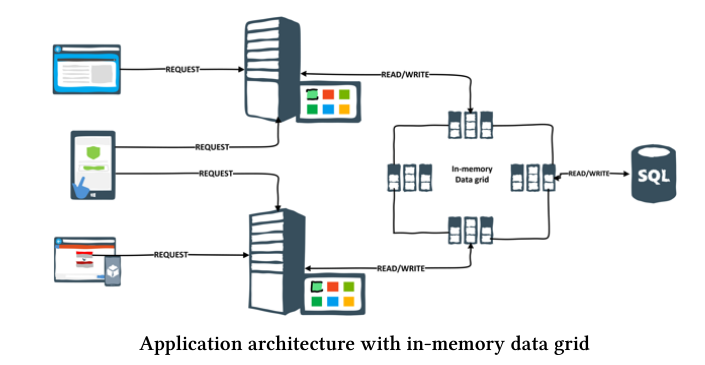

# Основные понятия
* High-performance computing - это аггрегация мощьностей многих машин для решения одной задачи.
* In-memory computing - обрабатываемые данные находтся в ОЗУ.
* Apache ignite представляет удобный интерфейс для работы с большими объемами данных
и для in-memory вычислений.
* In-memory data grid служит к качестве кеша и может асинхронно посылать и получать данные из дискового хранилища, может кластиризироваться.

# Инсталляция

```bash
curl -O http://apache-mirror.rbc.ru/pub/apache/ignite/2.1.0/apache-ignite-fabric-2.1.0-bin.zip
unzip apache-ignite-fabric-2.1.0-bin.zip  -d /opt

to ~/.profile
export IGNITE_HOME=YOUR_IGNITE_HOME_PATH
export PATH=$PATH:$JAVA_HOME/bin:$IGNITE_HOME/bin:$HOME/bin
source ~/.profile
Copy the folder $IGNITE_HOME/libs/optional/ignite-rest-http to IGNITE_HOME/libs, this will
enable the Ignite rest interface. Run ignite.sh in your any favorite terminal, which will run the
Apache Ignite with default configuration.
```
* Проверка работоспособности:
```
http://127.0.0.1:8080/ignite?cmd=version
```
* Multicast - это передача информации группе получателей.
* Запуск 2-х нод ксластера на одной машине (ignite использует мульткаст для обнаружения нод)
```
ignite.sh $IGNITE_HOME/examples/config/example-cache.xml
в разых консолях!
ignite.sh $IGNITE_HOME/examples/config/example-cache.xml
```
* Создадим или вернем testCache
```
http://127.0.0.1:8080/ignite?cmd=getorcreate&cacheName=testCache
```
* ignitevisorcmd.sh - cmd утилита для управления ignie.
* добавим в testCache пару {moscow,777}

```
http://127.0.0.1:8080/ignite?cmd=put&key=moscow&val=777&cacheName=testCache

```
* ignitevisorcmd.sh->connect 10-> cache постомтреть инфо о кешах
* получим элемент из кеша

```
http://localhost:8080/ignite?cmd=get&key=moscow&cacheName=testCache

```
* Можно получить сразу несколько значений из кеша
```
http://localhost:8080/ignite?cmd=getall&k1=moscow&k2=vladimir&k3=tver&cacheName=testCache
```

* для использования tcpv4 в java клиенте и в ignite.sh должно стоять
```java
 -Djava.net.preferIPv4Stack=true
```

* по умолчанию ignite выбирает порты 47500, 47501 etc.
* тестовый javaclient находится в ignite-book-code-samples/chapters/chapter-installation/
