# Структура ignite
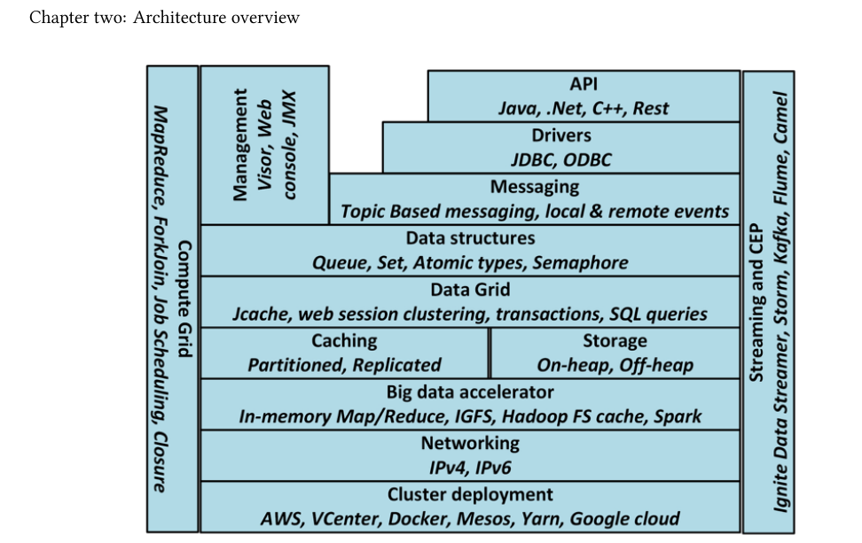
* все ноды равнозначны, нет никаких мастер-нод
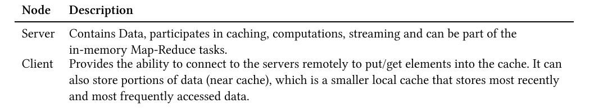
# Топология кластера
* Клиентские ноды могут выполнять рассчеты, более того можно создать клстер
в котором серверные ноды будут только хранить данные, а клинентские ноды их обрабатывать.
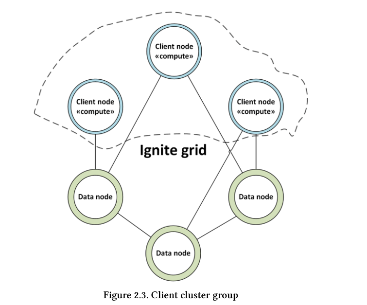
* Ноды ignite могут быть
  1. embedded
  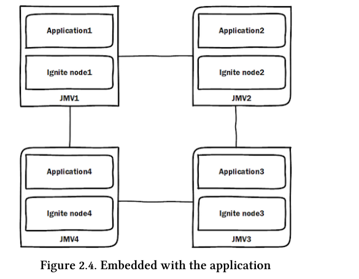
  2. in separate jvm
  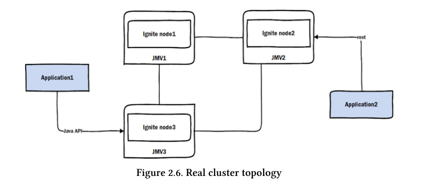
# Топология кеша
* Типы топологий
  1. Partitioned (топология по умолчанию) - данные кеша разбиты с избыточностью по нодам кластера.
  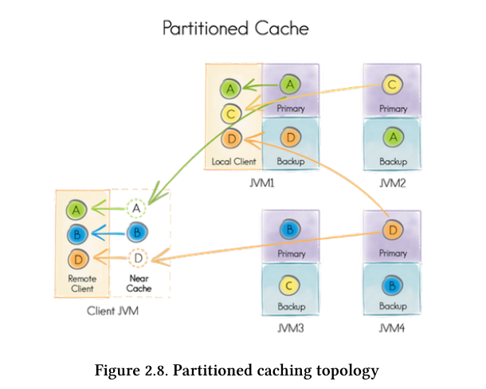
  2. Replicated - все данные хранятся на всех нодах - очень быстрый доступ к данным. Недостаток - каждая
  нова порция данных должна быть скопирована на все ноды - медленные апдейты. Подходит для быстрого доступа
  к небольшим редко изменяемым данным.
  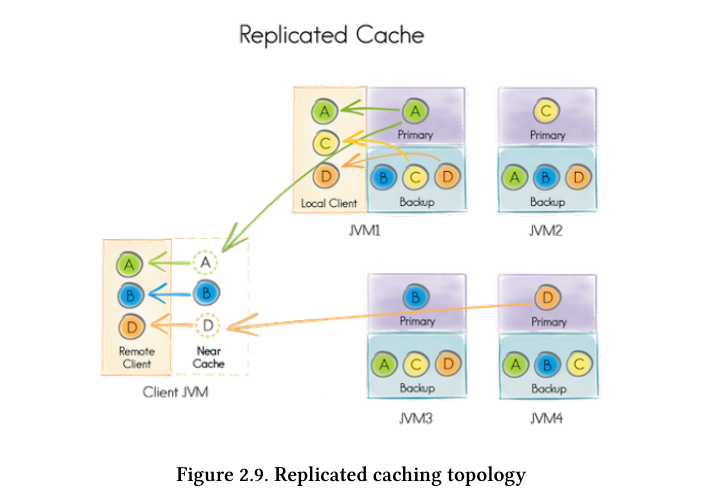
  3. Local - очень быстрый и хорошо подходит для read\wrtite-through кеша.

  # Стратегии использования кеша
    1. cache-aside - приложение само пишет данные в БД и обновлять кеш. Например если в кеше нет данных
    то они читаются приложением и записываются в кеш. При обновлении данных в БД приложение само обновляет кеш.
    2. Read-through and Write-through - приложение пишет и читает данные только из кеша. Кеш сам взаимодействует с БД.
    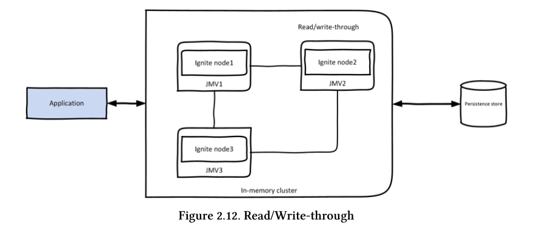
    3. Write behind - операции записи аггрегируются и асинхронно отправляются в дисковое хранилище.
    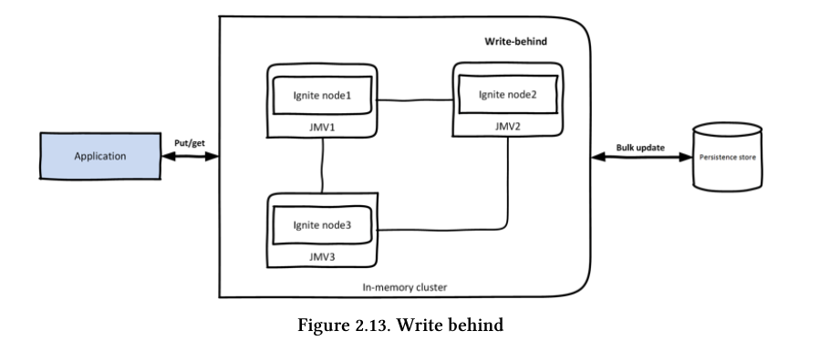
# Модель данных
 * Ignite использует хранилище типа key-value.
 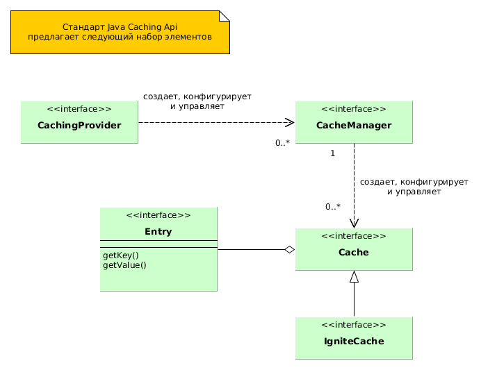

# CAP
    1. Consistency - все ноды имеют одни и теже данные.
    2. Availability - клиент может читать и писать
    3. Partitioning tolerance - система поддерживает партицирование, при выходе одной ноды з строя
    система все еще работоспособна
  CA - базы данных, AP - cassandra и тп.
* Ignite modes:
    1. Transactional - можно группировать коммманды (DML) в транзакцию и коммтить ее, будут использоваться
    пессиместические блокировки
    2. Atomic - каждая комманда (DML) может выполниться успешно либо не успешно, блокировок нет.
    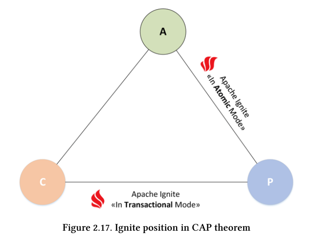
# Cluster groups
* В ignite все ноды равноценны но можно создать логическую группу. Например сгруппируем ноды
обслуживающие myCache:
```java
IgniteCluster cluster = ignite.cluster();
// All the data nodes responsible for caching data for "myCache".
ClusterGroup dataGroup = cluster.forDataNodes("myCache");
```
* Ноды в Ignite можно также сгруппировать по аттрибутам - master,worker,data nodes
```java
//запуск мастер-ноды
IgniteConfiguration cfg = new IgniteConfiguration();
Map<String, String> attrs = Collections.singletonMap("ROLE", "master");
cfg.setUserAttributes(attrs);
// Start Ignite node.
Ignite ignite = Ignition.start(cfg);
//далее можно получить все мастер ноды
IgniteCluster cluster = ignite.cluster();
ClusterGroup workerGroup = cluster.forAttribute("ROLE", "master");
Collection<GridNode> workerNodes = workerGroup.nodes();
```
# Выполнение SQL-запросов
* В партицированном кластере запросы выполняются в виде map-reduce работ
* В реплицированном кластере запросы выполняются используя H2 бд
# Асинхронные методы
* Асинхронне методы возвращают IgniteFuture<T> который имеет метод get - это тн promise -
обещание вернуть результат. Метод IgniteFuture.listen(FunctionalInterface) неблокирующий
и выполняется по готовности. Примеры кода в project-installation модуле.
# Resilence
* Термин означает скорейшее восстановление после сбоя, например нода будет
# API
автоподключаться к кластеру в случае сбоя.
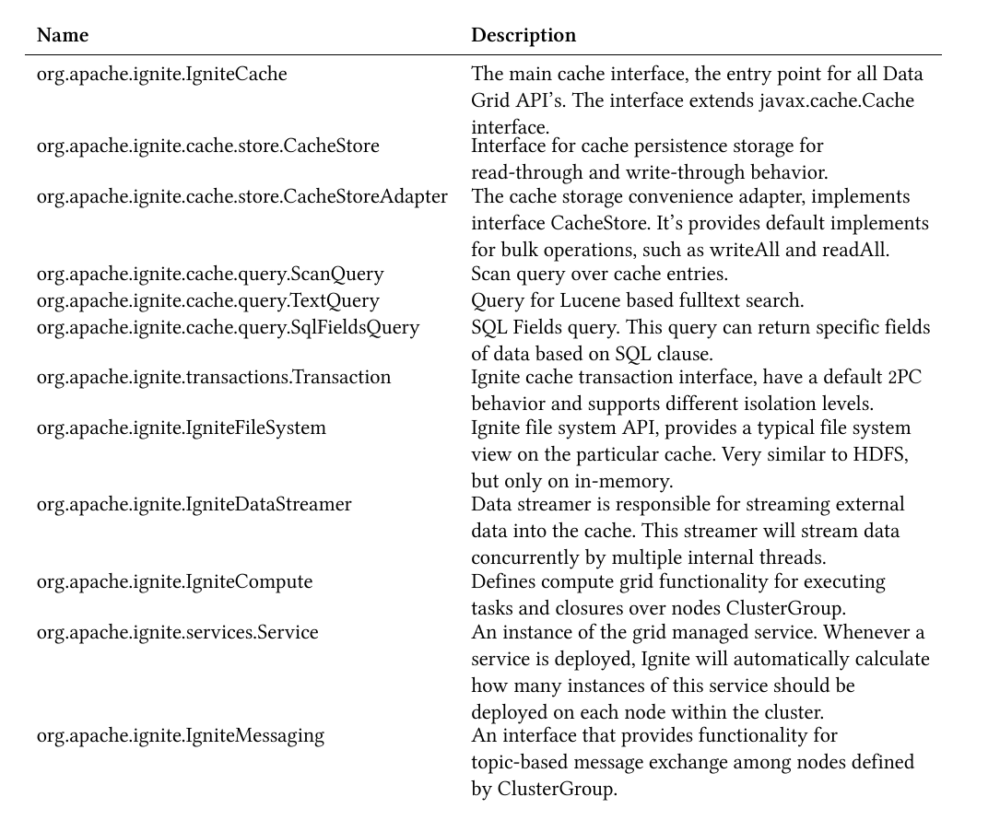
