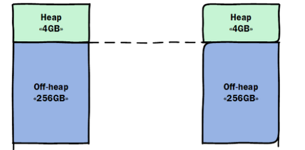
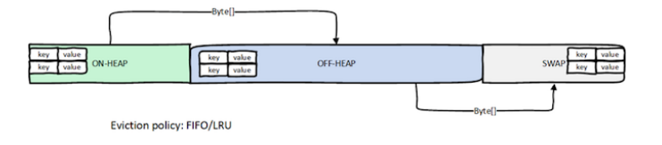

# in-memory caching
* 2nd leve chache управляется Persintence провайдером и прозрачен для пользователя
(многие EntityManagers видят данные из этого кеша).
* Ignite может содержать часть элементов внутри javaHeap и остальные в ОЗУ
(chapter-caching/offheap)

* Есть разные режимы хранения:
  1. ONHEAP_TIERED (default) - часть хранится в heap остальное в offheap,при достижении определенного размера
    лишние элементы уходят в offheap. Чтобы элементы перемещались в offheap нужно определить EvictionPolicy
    ```bash
    #запустить тетовый кеш
    ignite.sh $IGNITE_HOME/examples/config/example-cache.xml
    #запустить проект chapter-caching/offheap
    java -jar target/offheap-1.0-SNAPSHOT.one-jar.jar
    #запустить cli-интерфейс и подключиться к кластеру example-cache.xml
    ignitevisorcmd.sh->open->example-cache.xml
    cache -a показать статистику кешей
    ```
    
  2. OFFHEAP_TIERED - все элементы в offheap
  3. OFFHEAP_VALUES - ключи в heap, а соотв значения offheap
