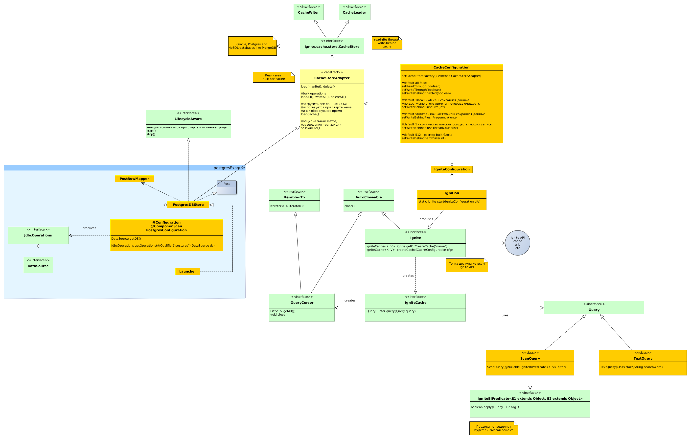
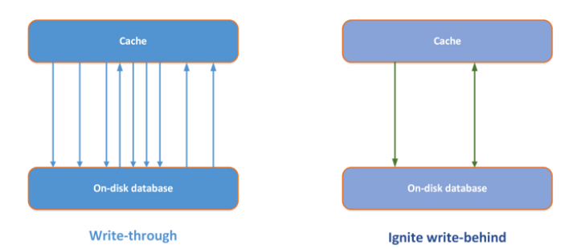
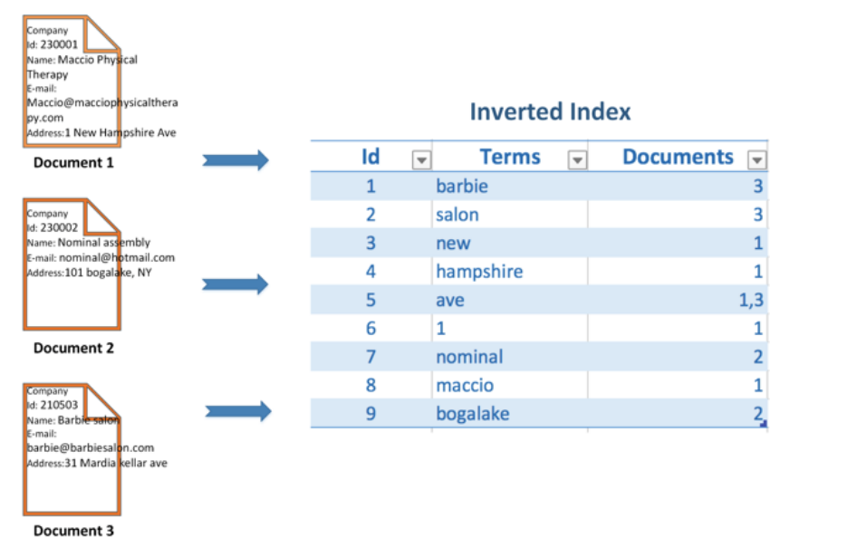
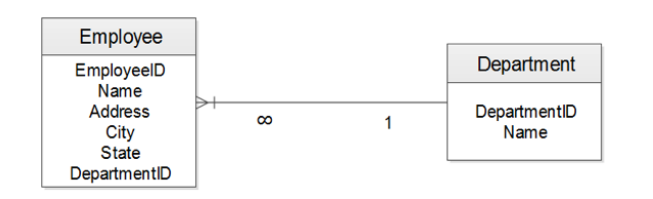
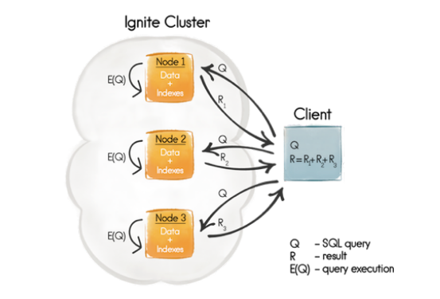
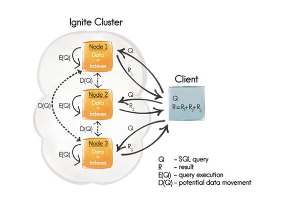
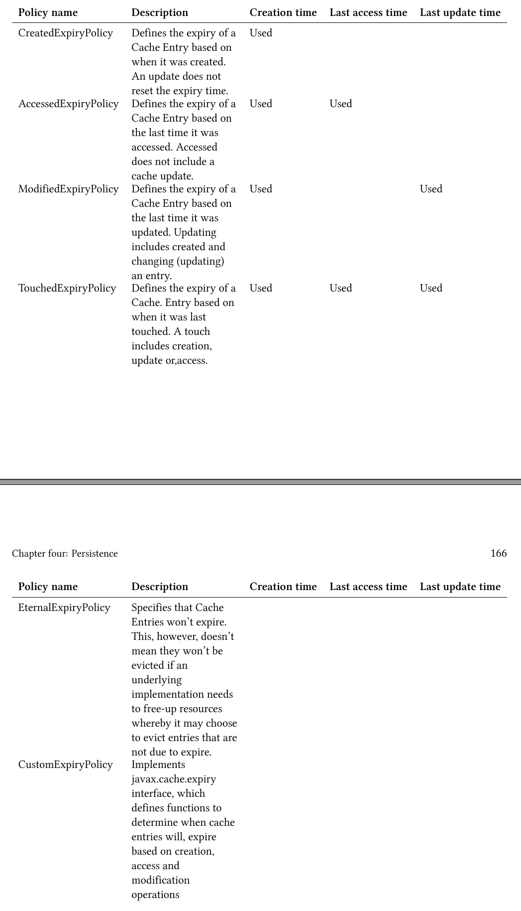
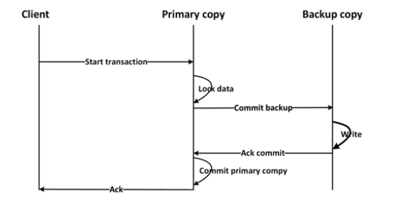
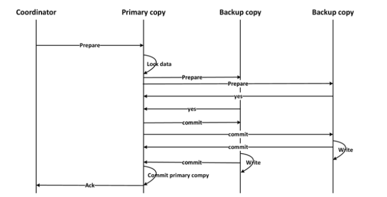

# Persistence
* Ignite реализует интерфейсы CacheLoader и CacheWriter из спецификации JCache.

* Частые обновления кеша могут привести к большим нагрузкам в persistence storage
для решения этой проблемы хорошо подходит write-behind кеш - который аккумилирует
обновления и затем отправляет их в бд.

*  Критерии, приводящие обновлению данный в write-behind mode:
    1. Временные - вышло максимальное время нахождения объекта в очереди на запись
    2. Размерные - очередь записывается на диск по достижению опр размера
    3. Комбинаия 1 и 2то
* при сипользовании write-behind только последнее обновление одного и того же ключа
попадет в persistence-хранилище.
# Persistence with postgres
* см пример postgesExample
# Cache queries
* Типы запросов:
  1. SqlQuery - sql запрос
  2. TextQuery - позволяет искать сущности по тексту
  3. QueryCursor - позволяет итерировать по страницам,не потоково безопасен
  и должен закрываться полсле использования.
  4. ScanQuery  - возвразает результат по предикату
  (предикат - это выражение возвращающее true\false)

  * IgniteBiPredicate - это функциональый интерфейс принимающий на вход ключ
  и значение - возвращает boolean - будет ли выбрана эта запись. Используется в
  ScanQuery.
  (см C4CacheQueries)

### Текстовые запросы
(см С4SqlQueries)
* Ignite использует Lucene для текстовых запросов.
* Документ в Lucene это экземпляр для индексации и поиска, сущность БД - это
документ для Lucine.
* Lucene использует инвертированный индекс - страница состоит из слов - а Lucene
привязывает слова к страницам.

* Чтобы включить поле в lucene-индекс его надо аннотировать @QueryTextField.
Можно аннотировать не сами поля а get-методы.
### SQL-запросы
(см C4SqlQueries)
* Выполнение <b>Joins</b> представляет собой нетривиальную задачу, достоверные
ответы могут быть получены если данные collocated - то находятся на той же
ноде что и join-запрос. <b>Replicated cache</b> лишен этого недостатка - тк все данные
хранятся на всех нодах.
* Для иллюстрации джоинов будет использовано простое отношение

* Для использования SQL-запросов поля сущности аннотируется через @QuerySqlField
либо сама сущность через @Queryentity.
* Для каждой сущности SqL есть 2 предопределенных поля _key и _val - это ключ и значение
в игнайт кеше. И можно выполнять запросы вида:
```sql
 SELECT * FROM Employee WHERE _key = 100
```
* Создание индеса по полю @QuerySqlField(index=true)
* Пример создания запроса, SqlQuery всегда возвращает всю сущность:
```sql
SqlQuery<EmployeeKey, Employee> empSal = new SqlQuery(Employee.class, "sal>?");
empSal.setArgs(1000);
```
* SqlFieldsQuery -возвращает не все поля, а только запрошенные. В курсоре будет массив имен:
```sql
SqlFieldsQuery empSalName = new SqlFieldsQuery("SELECT e.ename FROM Employee e WHERE sal > ?");
empSalName.setArgs("2000");
```
### Распределеные объединения.
* При использовании Replicated -кеша афинные ключи не нужны.
* Employee и соотв ему Department могут располагаться на разных нодах в Partitioned кеше
чтобы избежать этого и хранить их совместно на одной ноду Employee имеет так называемый
афинный ключ:
```java
    private final int empNo;
    @AffinityKeyMapped
    private final int deptNo;
```
При использовании афинного ключа и соотв collocated Join обработка запроса выглядит так:

* Имя кеша выступает в качетве схемы в Ignite, имя схемы берется а двойные кавычки.
### Non-colocated joins
* Если данные необходимые для выполнения джоин-запроса не содержатся в одной ноде,
то они будут запрошены из других нод кластера. Для включения такого режима нужно:
```java
SqlQuery.setDistributedJoins(true);
```
Естественно такой запрос будет выполнятся медленнее из-за доп сетевого траффика.
Афинный ключ в этом случае не требуется.

### Истечение времени жизни (Expiration) и удаление элементов (Eviction)
* Expiration ignite содержит множество политик, определяющих срок жизни элемента.
По умолчанию ни одна из политик не активна.

* Класс Duration определяет время жизни елемента

```java
Ignite ignite = Ignition.start(CLIENT_CONFIG);
CacheConfiguration cacheConfiguration = new CacheConfiguration("myCacheConfig");
cacheConfiguration.setExpiryPolicyFactory(CreatedExpiryPolicy.factoryOf(Duration.FIVE_MINUTES));
ignite.getOrCreateCache(cacheConfiguration);

```
* Eviction - это алгоритм, определяющий какие эелементы нужно удалить если кеш полон.
Можно определить Evicion по числу элементов или по размеру памяти кеша.
* LRU policy поддерживает удаление по макс числу елементов и по макс памяти кеша

```java
CacheConfiguration cacheCfg = new CacheConfiguration();
cacheCfg.setName("cacheName");
// Set the maximum cache size to 1 million (default is 100,000).
cacheCfg.setEvictionPolicy(new LruEvictionPolicy(1000000));
IgniteConfiguration cfg = new IgniteConfiguration();
cfg.setCacheConfiguration(cacheCfg);
// Start Ignite node.
Ignition.start(cfg);

```

* FIFO - first in - first out поддерживает удаление по макс числу елементов и по макс памяти кеша

```java
CacheConfiguration cacheCfg = new CacheConfiguration();
cacheCfg.setName("cacheName");
// Set the maximum cache size to 1 million (default is 100,000).
cacheCfg.setEvictionPolicy(new FifoEvictionPolicy(1000000));
IgniteConfiguration cfg = new IgniteConfiguration();
cfg.setCacheConfiguration(cacheCfg);
// Start Ignite node.
Ignition.start(cfg);

```

### Транзакции
* atomic (поумолчаню комманды выполняются по отдельности), transactional (группой),
определяется на уровне кеша. (см C4PostgesExample)
* Ignite транзакии могут охватывать сразу несколько кешей.
* Если в транзакции возникают ошибки - она автоматом откатывается.
* Методы запуска тразакций:

```java
ignite().transactions().txStart();//свойства транзакции берутся из TransactionConfiguration
//TransactionConfiguration - одержит свойства транзакций по умолчанию
txStart(TransactionConcurrency concurrency, TransactionIsolation isolation);
//new transaction with the specified concurrency and isolation.

```
* TransactionConcurrency= PESSIMISTIC or OPTIMISTIC.
* TransactionIsolation =  READ_COMMITTED, REPEATABLE_READ, SERIALIZABLE
* 1-phase commit используется если в кеше не более 2-х Replicated узлов с одной
бекап копией

* 2-phase commit работает если есть несколько backup-копий
Клиент инициирует коммит-> primary ноды (они хранят осн копию) получают prepare message -> primary nods
налагают блокировки на primary copy-> primay nods шлют prepare message  всем копиям-> по получению
положительного ответа от всех копий начинаетя запись данных в копии а потом и в осн. копию.


### Optimistic mode
 * Блокировки накладываются в начале на осн копии а потом и на бекапы на шаге prepare
 * Блокировки не накладываются если пользователь не закоммитил транзакцию
 * READ_COMMITTED - операции чтения не накладывают никаких блокировок, прочитав одни и теже
 данные 2 раза в течении транзакции можно получить разные результаты.Изменяемые данные копятся
 и записываются только в конце транзакции с использованием блокировок.
 * REPEATABLE_READ - чтение не накладывает блокировок но прочитанные данные кешируются,
 прочитав 2 раза одни и теже данные - всегда получим один и тот же результат
 * SERIALIZABLE - если хотябы один элемент транзакции модифицирован до коммита - то
 выбросим исключение

### Pessimistic mode
* Блокровки накладываются при первом доступе к объекту в начале на основные копии а потом
и на дополнительные на шаге prepare
*  READ_COMMITTED - возможны не повторяемые чтения(блокировок на чтение нет), при записи блокировки накладываются сразу.
*  REPEATABLE_READ - блокировки накладываются на чтение и на запись. Данные транзакии кешируются
локально и ниодна транзакция не может менять прочитанные или записанные в этой транзакции данные.
* SERIALIZABLE = REPEATABLE_READ
* Backup update mode - синхронный\асинхронный. В асинхронном режиме tx.commit(); не будет
дожидаться подтверждения записи от других нод.
